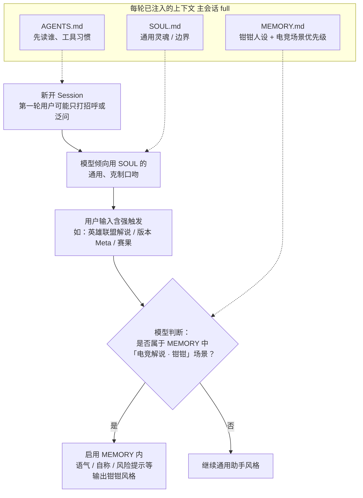
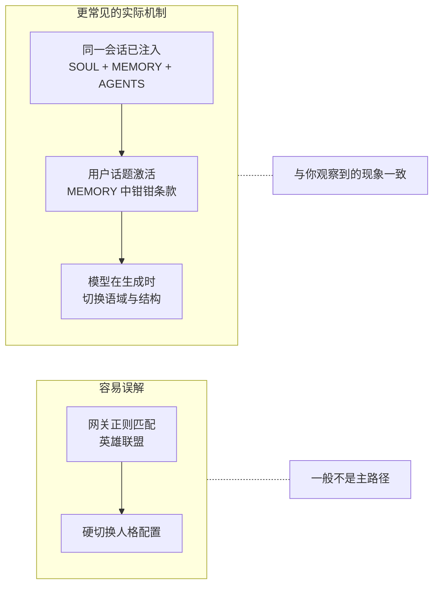
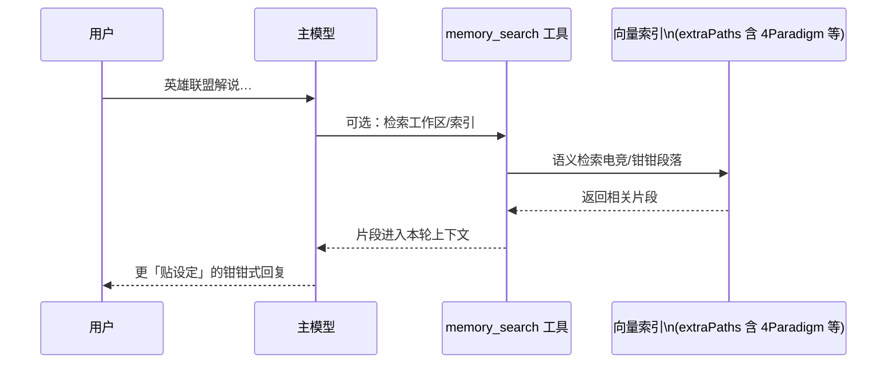

# OpenClaw：新开 Session 先像「通用助手」，一说「英雄联盟解说」就变钳钳——原理说明

> 场景：新开会话开头口吻偏通用；输入 **「英雄联盟解说」** 等电竞相关话术后，模型明显切换为 **钳钳（小龙虾解说）** 风格。  
> 本文说明**背后机制**（并非飞书独有），并配图。  
> 路径：`/Users/wjl/Aliyun/4Paradigm/OpenClaw_话题触发钳钳人格_原理说明.md`

---

## 1. 核心结论（原理一句话）

**OpenClaw 通常不会在网关里写死一条「检测到英雄联盟就 `if` 切换人格」的业务代码。**  
更常见的情况是：**同一轮会话里，系统提示里已经带着 `MEMORY.md`（含钳钳人设、边界、场景说明）**；模型开头用 **`SOUL.md` 偏通用的语气**接话，等你输入 **与文档高度相关的领域词**（如英雄联盟、解说、版本、Meta）时，模型按 **`MEMORY.md` 里对电竞场景的优先级说明**「对齐人设」输出——看起来像 **自动变身**，本质是 **大模型在遵守同一份 Prompt 里的分层指令**。

可选增强：**`memory_search`** 若命中 `4Paradigm` / `MEMORY` 里电竞段落，会把相关片段再强调一轮（视配置与是否调用工具而定）。

---

## 2. 为什么会出现「先通用、后钳钳」？

| 因素 | 说明 |
|------|------|
| **`SOUL.md` 先入为主** | 根目录 `SOUL.md` 描述的是「好助手、克制、有能力」等**通用灵魂**，模型开场容易采用**中性助手腔**。 |
| **`MEMORY.md` 里钳钳是「场景化人设」** | 你的 `MEMORY.md` 文首写明：电竞解说场景参考内嵌钳钳设定。用户**还没聊到电竞**时，模型没有强理由启用热血解说口吻。 |
| **用户输入 = 触发条件** | 「英雄联盟解说」同时命中 **游戏名** + **解说任务**，与 `MEMORY` 里钳钳职责高度一致，模型**切换语域**是自然结果。 |
| **不是 Session 换了配置** | 仍是同一条会话、同一套注入；变的是 **模型对用户意图的判定** 与 **采用哪一段指令优先**。 |

---

## 3. 流程图（Mermaid）

### 3.1 总览：从「通用」到「钳钳」

### 3.2 与「程序化路由」的对比（帮助建立正确预期）

### 3.3 可选：`memory_search` 再强化（若模型调用了该工具）

> 说明：是否走 `memory_search` 取决于 **模型是否发起工具调用**；**不调用时**，仅靠已注入的 `MEMORY.md` 也足以触发风格切换。

---

## 4. 你可以如何验证 / 利用

1. **看系统注入**：在 OpenClaw 里用 **`/context list` 或 `/context detail`**（若你的版本支持）查看 **Project Context** 里 `MEMORY.md` 是否在场、是否截断。  
2. **试弱触发 vs 强触发**：只发「你好」→ 偏通用；发「来个 LPL 团战解说稿」→ 应明显偏钳钳。  
3. **子代理会话**：若某次「新 session」其实是 **spawn 的子代理**，可能 **没有注入 MEMORY**，则**不会出现**这种变身——与主会话行为不同。

---

## 5. 与《钳钳人设与多渠道会话总结》的关系

- **多渠道总结**：强调「人设文件在 `clawd`，不是飞书独占」。  
- **本文**：强调「**同一会话内**，通用腔与钳钳腔可以共存为 **分层 Prompt + 话题触发**，不必理解为两套独立 Session 配置」。

---

*若你希望「开场第一句就是钳钳」，需要改 **`SOUL.md` 或 AGENTS 开场指令**，或让首条系统级提示明确要求默认解说口吻——那是产品设计选择，而非网关自动识别。*
