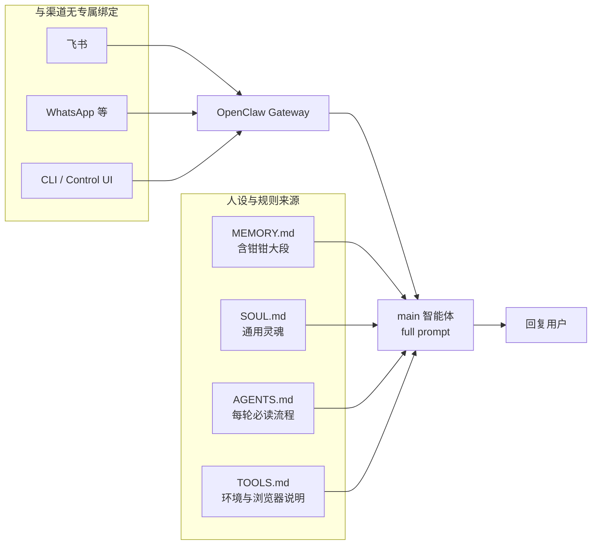
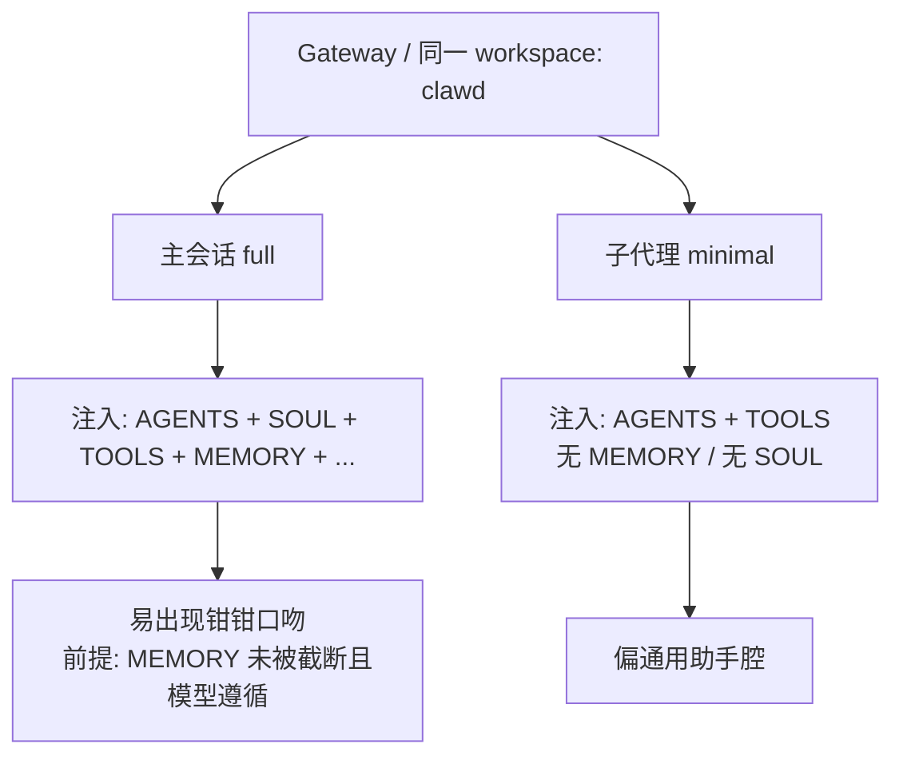
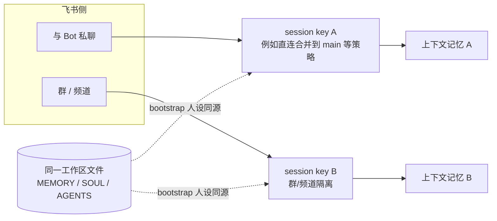

# OpenClaw：钳钳人设、飞书与「新 Session」——问题与结论总结

> 本文档汇总上一段对话中关于 **OpenClaw + 飞书 + 钳钳人格 + 新会话** 等问题的结论，便于日后查阅或与同事同步。  
> 路径：`/Users/wjl/Aliyun/4Paradigm/OpenClaw_钳钳人设与多渠道会话_总结.md`  
> 工作区（OpenClaw）：`/Users/wjl/clawd`

---

## 1. 核心问题（原话意涵）

**「是不是只有飞书频道才是钳钳风格？我新开一个 session 就不是了？」**

---

## 2. 结论（一句话）

**不是。** 钳钳相关内容主要来自工作区里的 **`MEMORY.md`（及内嵌人设说明）**，与「是不是飞书频道」**没有专属绑定**；同一 **`main` 智能体**、同一 **`clawd` 工作区**下，飞书与其它入口理论上共用同一套 bootstrap 注入。  
你感觉「新 session 不像钳钳」，多半来自 **会话类型不同**（尤其是 **子代理**）或 **入口根本不是 OpenClaw 这条线**。

---

## 3. 分点说明

### 3.1 人设内容主要在哪？

| 文件 | 作用 |
|------|------|
| **`/Users/wjl/clawd/MEMORY.md`** | 合并了「电竞解说 · 小龙虾 · 钳钳」等大段人设与技能说明；文首注明与根目录 `SOUL.md` 的并存优先级。 |
| **`/Users/wjl/clawd/SOUL.md`** | 通用助手灵魂/边界（偏「好助手」而非电竞解说口吻）。 |
| **`/Users/wjl/clawd/AGENTS.md`** | 每轮要先读哪些文件、工具习惯（含浏览器 profile、`.learnings` 等）。 |

OpenClaw 在 **完整（full）主会话** 下，会把多份 bootstrap 文件注入系统提示（详见官方文档 *System Prompt* → *Workspace bootstrap injection*）。

### 3.2 为什么「新 session」可能不像钳钳？

1. **子代理（subagent / `sessions_spawn`）**  
   - 子代理常用 **minimal** 提示模式。  
   - **仅注入 `AGENTS.md` + `TOOLS.md`**，**不注入 `SOUL.md` / `MEMORY.md`**。  
   - 结果：口吻回到**通用助手**，不会出现大段钳钳设定。

2. **入口不同**  
   - 例如 **Cursor 新对话**、其它 App、**另一个 agentId / 另一个 workspace**，**不会**自动读 `clawd/MEMORY.md`。

3. **`AGENTS.md` 第 4 条的表述容易误解**  
   - 写的是：**MAIN SESSION（与人类的直连私聊）要「Also read MEMORY.md」**。  
   - 这是 **安全/隐私** 导向（群聊慎用个人长期记忆），**不等于**「只有飞书才有钳钳」。  
   - 模型若 **过度遵守**「非 main 少碰 MEMORY」，在 **群/频道** 里可能 **刻意弱化** 钳钳口吻。

4. **飞书内：私聊 bot vs 群/频道**  
   - 在 OpenClaw 里对应 **不同 session key**，上下文 **不共用**。  
   - 但 **人设来源仍是同一工作区文件**，不是「频道独占钳钳」。

### 3.3 若希望「尽量都像钳钳」

- 在 **`SOUL.md` 靠前位置**增加 **短固定人设**（几句身份 + 语气），因 **`SOUL` 会进主会话 bootstrap**；  
- **子代理**若也要口吻一致，需单独策略（例如缩短子任务提示或接受子代理偏工具向、不扮演钳钳）。

---

## 4. 关系示意图（Mermaid）

### 4.1 数据从哪来、和谁无关

### 4.2 主会话 vs 子代理（为何新 session「不像钳钳」）

### 4.3 飞书内：不同会话键（上下文隔离）

---

## 5. 与上一会话相关的其它结论（简表）

| 主题 | 结论摘要 |
|------|-----------|
| 网页搜不到 | `web_search` 与聊天模型独立；曾用 `gemini` 但未配 `GEMINI_KEY` 会失败；已改为 **`provider: kimi`** 复用 `MOONSHOT_API_KEY`。 |
| 默认搜索 | `tools.web.search` 显式启用 + 参数；`web_fetch` 启用；`TOOLS.md` 约定「时效/事实先搜」。 |
| 浏览器 / MCP | OpenClaw 用 **`browser` 工具** + 档案（`openclaw` / `user`≈DevTools MCP / `chrome-relay` 扩展）；非 Cursor 式 `mcpServers` 列表；已写 `openclaw.json` + `AGENTS`/`TOOLS`。 |
| 飞书是否独占钳钳 | **否**；差异主要来自 **会话类型（尤其子代理）** 与 **模型对 AGENTS 的理解**，而非「只有飞书才加载人设文件」。 |

---

## 6. 维护建议

- 改钳钳正文：优先在 **`Aliyun/4Paradigm/OpenClaw-电竞解说-小龙虾`** 维护，再同步到 **`clawd/MEMORY.md`**（或你的合并脚本）。  
- 排查「不像钳钳」：先问 **是不是子代理**、**是不是同一 agent/workspace**、**是否群聊模型在克制 MEMORY**。  
- 需要全渠道统一口吻：考虑 **`SOUL.md` 增加短人设** + 控制 **`MEMORY.md` 体积**，避免 bootstrap 截断把人设裁掉。

---

*文档生成目的：归档「飞书 vs 新 session vs 钳钳」问答结论；图示便于快速对齐概念。*
