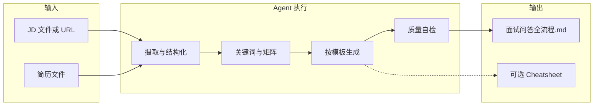

# 设计方案：interview-qa-jd-resume

## 1. 背景与目标

**问题**：面试准备分散在「看 JD、改简历、脑内模拟」之间，缺少一份 **与岗位逐条对齐、且答案锚定简历事实** 的可执行剧本。

**目标**：给定 **JD** 与 **简历**，自动生成结构化文档，覆盖从匹配分析到模拟节奏的全流程；流程可被 Agent 稳定复现，人类可审阅与背诵。

**非目标**：不替代真实面试表现；不编造简历未体现的经历；不保证录用结果。

---

## 2. 系统边界

| 在内 | 在外 |
|------|------|
| 文本类 JD / 可读的 PDF、图片 JD | OCR 质量极差且无法人工补全的扫描件 |
| 候选人提供的简历文件 | 背调、薪资谈判策略 |
| 单岗位、单次生成主文档 | 多岗位批量对比（可后续扩展） |

---

## 3. 架构概览

采用 **「规范驱动 + 单次流水线」**：人类维护少量 Markdown 规范文件，Agent 按规范执行摄取、对齐、生成、自检。

---

## 4. 文件职责（本目录）

| 文件 | 读者 | 职责 |
|------|------|------|
| `SKILL.md` | Agent | 执行步骤、输出模板、答题原则；含 YAML 元数据供 Skill 发现 |
| `SOUL.md` | 人类 | 调用方式、路径约定、与 `~/.cursor/skills` 的关系 |
| `设计方案.md` | 人类 / 协作者 | 为何这样设计、数据流、扩展点 |
| `对话示例.md` | 人类 | 典型对话与反例，降低首次调用试错成本 |
| `README.md` | 人类 | 入口说明与快速上手 |

规范单一来源：`SKILL.md` 中的模板与步骤变更时，**设计方案** 仅在有架构级变化时同步更新。

---

## 5. 数据处理流程

1. **JD 摄取**：本地优先；URL 失败时降级为请求用户粘贴全文，避免幻觉补全 JD。
2. **简历摄取**：PDF 默认 PyMuPDF 文本层；失败再尝试其他手段；仍失败则标明缺口。
3. **对齐**：从 JD 抽取职责、任职资格、硬技能、软技能、年限；与简历段落做 **显式引用式** 匹配（公司 / 项目 / 数据）。
4. **生成**：严格按 `SKILL.md` 章节顺序填充，保证 **匹配度矩阵 → 自我介绍 → 项目 STAR → 场景题 → 行为面 → 反问 → 节奏** 的依赖顺序（先有证据再写答案）。
5. **自检**：结论可追溯至简历原句；数字与原文一致；缺口标「需补充」。

---

## 6. 输出契约

- **主交付物**：`面试问答全流程-{公司}-{岗位简写}.md`（路径可由用户指定）。
- **语言**：与用户对话语言一致，默认中文。
- **可选**：半页 Cheatsheet，不重复粘贴长段 STAR，仅数字与故事标题。

---

## 7. 质量门禁

- **真实性**：无简历支撑的能力不写成「我负责了……」的肯定句。
- **岗位相关性**：场景题必须体现从 JD 抽出的关键词（如搜索、指标、LLM、协同）。
- **可模拟性**：每段答案能在 30 秒 / 2 分钟两档口述。

---

## 8. 扩展与维护

- **新岗位类型**：在 `SKILL.md` 的「岗位场景题」部分增加行业子模板（如广告、电商），或拆 `reference-*.md` 由 Agent 按需读取（保持一级引用）。
- **多轮迭代**：用户补充「面试官反馈」后，可追加同文件「复盘补丁」小节，无需改架构。

---

## 9. 版本与变更记录

| 版本 | 说明 |
|------|------|
| 0.1 | 初版：JD + 简历 → 全流程 Markdown；SKILL + SOUL |

后续重大变更请在本表追加一行。
